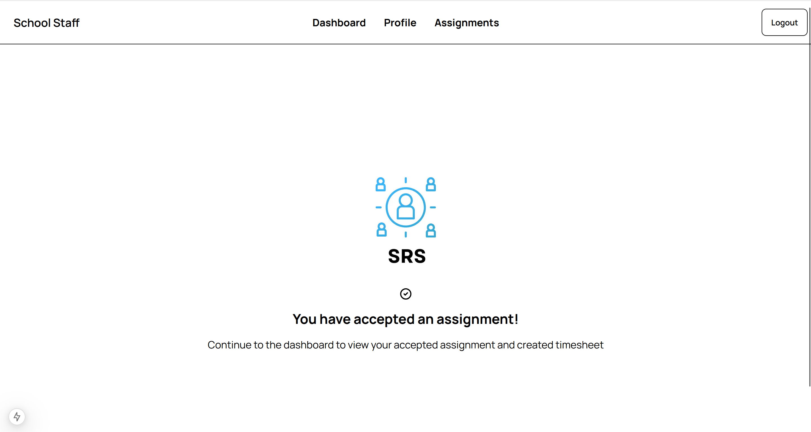
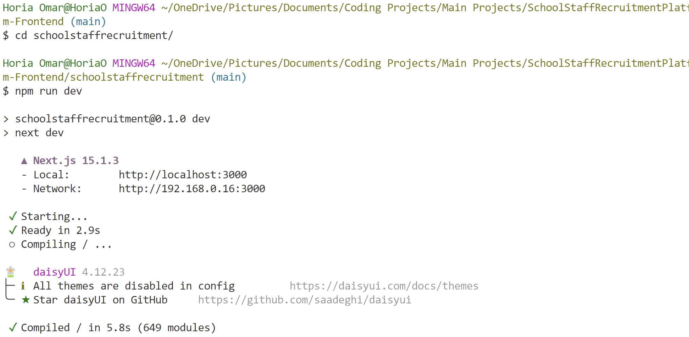
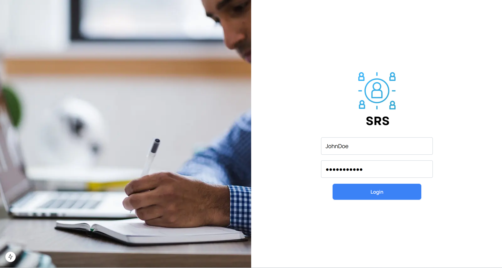
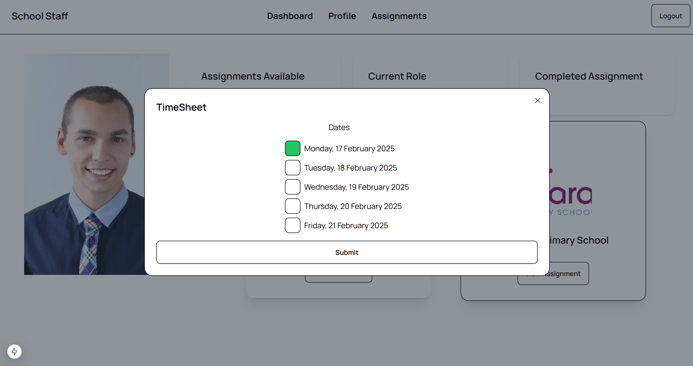

# SchoolStaffRecruitmentPlatform-Frontend

This project is running on Next.js.

https://nextjs.org/docs/app/getting-started/installation

You also need Visual Studio Code.

## Installation

To run this project locally, follow these steps:

Clone the repository:

```git clone <repository_url>```

Install dependencies:

```npm install```

Run the frontend of the project:

Make sure to change directory when doing ```npm run dev```





Once you click on 'http://localhost:3000/' you should see the login page.

Here is where you can login with the username and password you registered in postman




## Dashboard

When you intially log in, you will see this page:



## Profile Page where you can update Profile Description


Click the pencil icon to open a text input to update the content of the Description


## View the assignments for teachers on the Assignment Page

This is a list of unassigned Assignments for a teacher to pick from. You can only pick one.


## Accept an assignment on the Assignment Page


## Click accept an assignment on the Assignment Page

If accept an assignment you will met with this page:


## Return to the dashboard to view your timesheet and accepted Assignment


For the timesheet the submit button is disabled as you have not yet reached the end of your assignment.