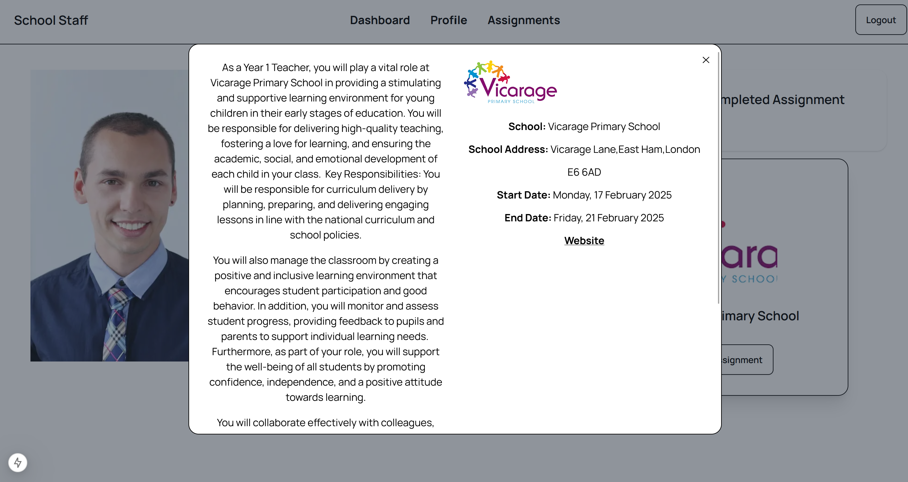

# SchoolStaffRecruitmentPlatform-Frontend

This project is running on Next.js.

https://nextjs.org/docs/app/getting-started/installation

## Installation

To run this project locally, follow these steps:

Clone the repository:

```git clone <repository_url>```

Install dependencies:

```npm install```

Run the frontend of the project:

Make sure to change directory when doing ```npm run dev```




